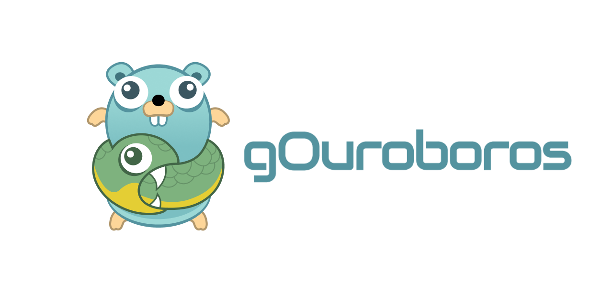

<div align="center">
  
  <br>
  
  <a href="https://pkg.go.dev/github.com/blinklabs-io/gouroboros"></a>
  <a href="https://deepwiki.com/blinklabs-io/gouroboros"></a>
  <a href="https://discord.gg/5fPRZnX4qW"></a>
</div>

## Introduction

gOuroboros is a powerful and versatile framework for building Go apps that interact with the Cardano blockchain. Quickly and easily
write Go apps that communicate with Cardano nodes or manage blocks/transactions. Sync the blockchain from a local or remote node,
query a local node for protocol parameters or UTxOs by address, and much more.

## Features

This is not an exhaustive list of existing and planned features, but it covers the bulk of it.

- [ ] Ouroboros support
  - [ ] Muxer
    - [X] support for multiple mini-protocols over single connection
    - [X] support for separate initiator and responder instance for each protocol
    - [X] support for buffer limits for each mini-protocol
  - [ ] Protocols
    - [X] Handshake
      - [X] Client support
      - [X] Server support
    - [X] Keepalive
      - [X] Client support
      - [X] Server support
    - [X] ChainSync
      - [X] Client support
      - [X] Server support
    - [X] BlockFetch
      - [X] Client support
      - [X] Server support
    - [X] TxSubmission
      - [X] Client support
      - [X] Server support
    - [X] PeerSharing
      - [X] Client support
      - [X] Server support
    - [X] LocalTxSubmission
      - [X] Client support
      - [X] Server support
    - [X] LocalTxMonitor
      - [X] Client support
      - [X] Server support
    - [ ] LocalStateQuery
      - [X] Client support
      - [X] Server support
      - [ ] Queries
        - [X] System start
        - [X] Current era
        - [X] Chain tip
        - [X] Era history
        - [X] Current protocol parameters
        - [ ] Future protocol parameters
        - [X] Stake distribution
        - [X] Non-myopic member rewards
        - [X] Proposed protocol parameter updates
        - [X] UTxOs by address
        - [X] UTxO whole
        - [X] UTxO by TxIn
        - [X] Debug epoch state
        - [X] Filtered delegations and reward accounts
        - [X] Genesis config
        - [X] Reward provenance
        - [X] Stake pools
        - [X] Stake pool params
        - [X] Reward info pools
        - [X] Pool state
        - [X] Stake snapshots
        - [X] Pool distribution
        - [X] Constitution ([CIP-1694](https://cips.cardano.org/cip/CIP-1694))
        - [X] Governance state ([CIP-1694](https://cips.cardano.org/cip/CIP-1694))
        - [X] DRep state ([CIP-1694](https://cips.cardano.org/cip/CIP-1694))
        - [X] DRep stake distribution ([CIP-1694](https://cips.cardano.org/cip/CIP-1694))
        - [X] SPO stake distribution ([CIP-1694](https://cips.cardano.org/cip/CIP-1694))
        - [X] Committee state ([CIP-1694](https://cips.cardano.org/cip/CIP-1694))
        - [X] Filtered vote delegatees ([CIP-1694](https://cips.cardano.org/cip/CIP-1694))
        - [X] Governance proposals ([CIP-1694](https://cips.cardano.org/cip/CIP-1694))
        - [X] Ratification state ([CIP-1694](https://cips.cardano.org/cip/CIP-1694))
        - [ ] Treasury ([CIP-1694](https://cips.cardano.org/cip/CIP-1694))
        - [X] Account state (treasury/reserves)
        - [X] Ledger peer snapshot
    - [X] LeiosFetch ([CIP-0164](https://cips.cardano.org/cip/CIP-0164))
      - [X] Client support
      - [X] Server support
    - [X] LeiosNotify ([CIP-0164](https://cips.cardano.org/cip/CIP-0164))
      - [X] Client support
      - [X] Server support
    - [X] LeiosVotes ([CIP-0164](https://cips.cardano.org/cip/CIP-0164))
      - [X] Client support
      - [X] Server support
    - [X] LocalMessageSubmission ([CIP-0137](https://cips.cardano.org/cip/CIP-0137) DMQ)
      - [X] Client support
      - [X] Server support
    - [X] MessageSubmission ([CIP-0137](https://cips.cardano.org/cip/CIP-0137) DMQ)
      - [X] Client support
      - [X] Server support
    - [X] LocalMessageNotification ([CIP-0137](https://cips.cardano.org/cip/CIP-0137) DMQ)
      - [X] Client support
      - [X] Server support
    - [ ] PerasVotes ([CIP-0140](https://cips.cardano.org/cip/CIP-0140), [Tweag cardano-peras](https://github.com/tweag/cardano-peras)) - mini-protocol number reserved (17); client/server not yet implemented
      - [ ] Client support
      - [ ] Server support
- [ ] Ledger
  - [ ] Eras
    - [X] Byron
      - [X] Blocks
      - [X] Transactions
      - [X] TX inputs
      - [X] TX outputs
    - [X] Shelley
      - [X] Blocks
      - [X] Transactions
      - [X] TX inputs
      - [X] TX outputs
      - [X] Parameter updates
    - [X] Allegra
      - [X] Blocks
      - [X] Transactions
      - [X] TX inputs
      - [X] TX outputs
      - [X] Parameter updates
    - [X] Mary
      - [X] Blocks
      - [X] Transactions
      - [X] TX inputs
      - [X] TX outputs
      - [X] Parameter updates
    - [X] Alonzo
      - [X] Blocks
      - [X] Transactions
      - [X] TX inputs
      - [X] TX outputs
      - [X] Parameter updates
    - [X] Babbage
      - [X] Blocks
      - [X] Transactions
      - [X] TX inputs
      - [X] TX outputs
      - [X] Parameter updates
    - [X] Conway
      - [X] Blocks
      - [X] Transactions
      - [X] TX inputs
      - [X] TX outputs
      - [X] Parameter updates
      - [X] Every key-hash reward credential present in withdrawals requires a
        DRep vote delegation at PV10/PV11, including zero amounts
    - [X] Dijkstra
      - [X] Blocks
      - [X] Transactions
      - [X] TX inputs
      - [X] TX outputs
      - [X] Parameter updates
      - [X] Reward withdrawals no longer require a DRep vote delegation at
        PV12+ ([CIP-0181](https://cips.cardano.org/cip/CIP-0181))
  - [X] Transaction attributes
    - [X] Inputs
    - [X] Outputs
    - [X] Metadata
    - [X] Fees
    - [X] TTL
    - [X] Certificates
    - [X] Staking reward withdrawals
    - [X] Protocol parameter updates
    - [X] Auxiliary data hash
    - [X] Validity interval start
    - [X] Mint operations
    - [X] Script data hash
    - [X] Collateral inputs
    - [X] Required signers
    - [X] Collateral return ([CIP-0040](https://cips.cardano.org/cip/CIP-0040))
    - [X] Total collateral ([CIP-0040](https://cips.cardano.org/cip/CIP-0040))
    - [X] Reference inputs ([CIP-0031](https://cips.cardano.org/cip/CIP-0031))
    - [X] Voting procedures ([CIP-1694](https://cips.cardano.org/cip/CIP-1694))
    - [X] Proposal procedures ([CIP-1694](https://cips.cardano.org/cip/CIP-1694))
    - [X] Current treasury value ([CIP-1694](https://cips.cardano.org/cip/CIP-1694))
    - [X] Donation ([CIP-1694](https://cips.cardano.org/cip/CIP-1694))
- [X] Block Validation
  - [X] Block body hash validation
  - [X] VRF proof verification
  - [X] KES signature verification
  - [X] Transaction validation (UTxO rules)
  - [X] Stake pool verification
  - [X] Native script evaluation
  - [X] Plutus script validation (via plutigo)
  - [X] Structured error handling (ValidationError)
  - [X] Byron era validation (OBFT consensus, proxy signatures, body proof)
- [X] Cryptography
  - [X] KES (Key-Evolving Signatures)
    - [X] Signature verification
    - [X] Key generation
    - [X] Key evolution
  - [X] VRF (Verifiable Random Function)
    - [X] Proof generation
    - [X] Proof verification
    - [X] Leader election input construction
- [ ] Consensus
  - [X] Leader election
  - [X] Block construction
  - [X] Chain selection
  - [X] Threshold calculation
  - [X] Genesis configuration
  - [X] Byron consensus (OBFT header validation)
- [X] Testing
  - [X] Test framework for mocking Ouroboros conversations
  - [X] Conformance suites (see `internal/test/conformance/README.md`; suites have separate scopes)
    - [X] Ledger rules (pinned Cardano Blueprint corpus; coverage reported by era and rule family)
    - [X] VRF cryptography (29 vectors + 15 unit tests)
    - [X] KES cryptography (14 tests via input-output-hk/kes vectors)
    - [X] Consensus (222 tests for leader election, threshold, selection)
    - [X] Byron blocks (15 tests from mainnet/testnet/conformance)
  - [X] Fuzz testing (19 targets, 14 in nightly CI)
  - [X] CBOR deserialization and serialization
    - [X] Protocol messages
    - [X] Ledger
      - [X] Block parsing
      - [X] Transaction parsing
- [ ] Misc
  - [X] Address handling ([CIP-0019](https://cips.cardano.org/cip/CIP-0019))
    - [X] Decode from bech32 ([CIP-0005](https://cips.cardano.org/cip/CIP-0005))
    - [X] Encode as bech32 ([CIP-0005](https://cips.cardano.org/cip/CIP-0005))
    - [X] Deserialize from CBOR
    - [X] Retrieve staking key

## Testing

gOuroboros includes automated tests that cover various aspects of its
functionality.

### Running the automated tests

```
make test
```

### Running cardano-node integration tests

The opt-in integration suite connects to a real node, reads its chain tip,
decodes a block, and exercises ChainSync restart behavior. It requires a
running node with a nonempty chain and access to its Node-to-Client socket.
See [the integration test guide](internal/test/cardano-node-integration/README.md)
for setup and run instructions.

### Running the linter

gOuroboros uses [golangci-lint](https://golangci-lint.run/) for code quality checks. Install it following the
[official installation guide](https://golangci-lint.run/docs/welcome/install/local/), then run:

```
make lint
```
